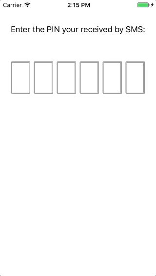

# PinCodeView

`PinCodeView` is a drop-in pin code input field for digits and alpha-numerics.



## Demo

See `PinCodeView` in action on [Appetize.io](https://appetize.io/app/wtu3jz6kcex9cf6jdu1mjmyzrm)

## Instalation

### CocoaPods

[CocoaPods](http://cocoapods.org) is a dependency manager for Objective-C, which automates and simplifies the process of using 3rd-party libraries like `PinCodeView` in your projects. 

First, add the following line to your [Podfile](http://guides.cocoapods.org/using/using-cocoapods.html):

```ruby
pod 'PinCodeView'
```

Then, run the following line for integrating it into your project.

```ruby
pod install
```

### Manually

Clone the repo, and drag the files inside `Source/` directory into your project

## Usage

You can use `PinCodeView` from your interface builder or you can add it in code.

In every case, you must provide some data for the view to know how to present.

### Add the view itself

```swift
let pinView = PinCodeView(numberOfDigits: 6, textType: .numbers, groupingSize: 3, itemSpacing: 7)
pinView.delegate = self
pinView.digitViewInit = PinCodeDigitSquareView.init
self.view.addSubview(pinView)
// set your frame / constraints as you wish
```

### Implement the delegate methods (optional)

```swift
 func pinCodeView(_ view: PinCodeView, didSubmitPinCode code: String, isValidCallback callback: @escaping (Bool) -> Void) {
    
    // here you can show your progress or do any UI action

    API.verifyCode(code, completion: { isValid in
        callback(isValid)
    })
 }
    
func pinCodeView(_ view: PinCodeView, didInsertText text: String) {
    // that's the place for hiding error views, etc
}
```

### Customizing!

The view is implemented to allow customization for the single digit views.

So, all you have to to is implement your own view that conform to `PinCodeDigitView`:

```swift
public protocol PinCodeDigitView: class {
    init()
    var digit: String? { get set }
    var state: PinCodeDigitViewState! { get set }
    func configure(withState: PinCodeDigitViewState)
    
    // hackish way to constraint to UIView only
    var view: UIView { get }
}
```

(note: if you have a better way to make it require the class to be UIView subclass create a pull request plz)

## License

`PinCodeView` is distributed under the terms and conditions of the [MIT license](https://github.com/SVProgressHUD/SVProgressHUD/blob/master/LICENSE.txt).

## Credits

`PinCodeView` is brought to you by Ariel Pollack, and was developed for [Dapulse](https://dapulse.com)'s iOS app. 

If you're using `PinCodeView` in your project, attribution would be very appreciated.